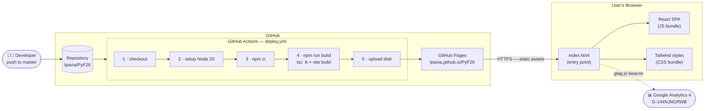
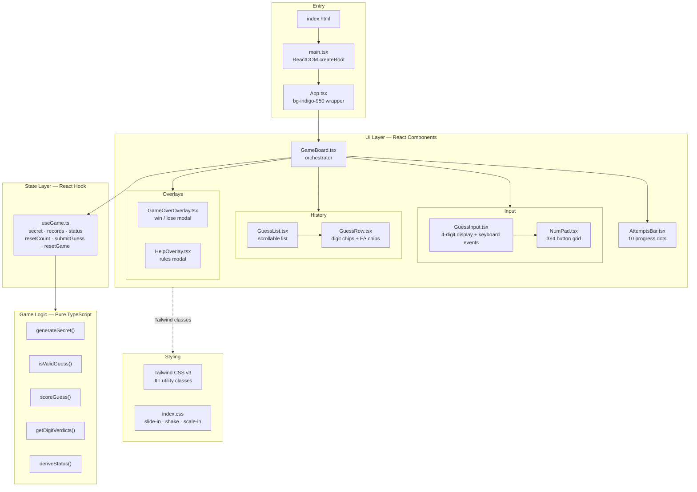
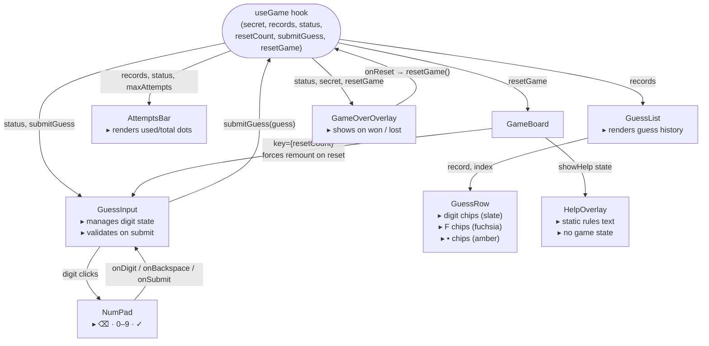

# PyF26 — Architecture Overview

> **Stack:** React 18 · TypeScript 5.6 · Vite 6 · Tailwind CSS 3
> **Hosting:** GitHub Pages · **CI/CD:** GitHub Actions · **Analytics:** Google Analytics 4

---

## 1. Deployment & Infrastructure

End-to-end flow from code commit to the player's browser.



---

## 2. Application Layers

Internal structure of the React SPA running in the browser. No backend exists — all logic runs client-side.



---

## 3. Component Data Flow

How state and events move between components during a game turn.



---

## 4. File Map

```
PyF26/
├── index.html                  ← entry, GA tag, theme-color, viewport-fit
├── vite.config.ts              ← base: '/PyF26/', react plugin
├── tailwind.config.js          ← content glob: src/**/*.{ts,tsx}
├── postcss.config.js
├── tsconfig.json / tsconfig.app.json / tsconfig.node.json
├── .github/
│   └── workflows/
│       └── deploy.yml          ← CI/CD: build → GitHub Pages
└── src/
    ├── main.tsx                ← ReactDOM.createRoot
    ├── App.tsx                 ← root layout (bg-indigo-950)
    ├── index.css               ← Tailwind directives + keyframes
    ├── vite-env.d.ts
    ├── game/
    │   └── logic.ts            ← pure TS: generateSecret, scoreGuess, deriveStatus…
    ├── hooks/
    │   └── useGame.ts          ← all game state (React hook)
    └── components/
        ├── GameBoard.tsx       ← orchestrator, fixed-height card
        ├── GuessInput.tsx      ← 4-box display + keyboard listener
        ├── NumPad.tsx          ← mobile number pad
        ├── GuessList.tsx       ← scrollable history
        ├── GuessRow.tsx        ← single attempt row
        ├── AttemptsBar.tsx     ← 10-dot progress indicator
        ├── GameOverOverlay.tsx ← win/lose modal
        └── HelpOverlay.tsx     ← rules modal
```

---

## Key Design Decisions

| Decision | Rationale |
|---|---|
| No backend | All logic is deterministic and runs safely in the browser — no server needed |
| Pure functions in `logic.ts` | Keeps game rules testable and completely decoupled from React |
| `status` derived, never stored | Eliminates state sync bugs — single source of truth is `records[]` |
| `key={resetCount}` on GuessInput | Forces full remount on reset, clearing digit state without prop drilling |
| `base: '/PyF26/'` in Vite | Required for correct asset paths on GitHub Pages subdirectory hosting |
| `viewport-fit=cover` + `theme-color` | Fills mobile safe-area zones (status bar, home indicator) with app background |
